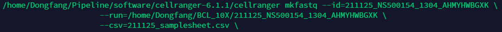
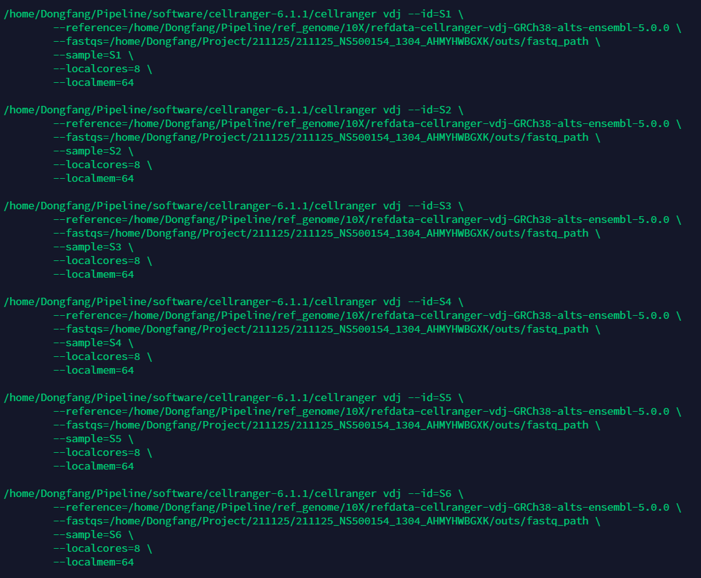

#Cell Ranger V(D)J Algorithms Overview


The figure above shows 10x V(D)J read-pairs aligned to an assembled contig, illustrating the structure of the read data. One to several UMIs are captured for each V(D)J chain. A round of enrichment PCR targeting the 5′ end to the C-region, followed by enzymatic fragmentation results in a pool of molecules originating from the same transcript. The molecules carry the same 10x barcode and UMI sequences, but with different insert lengths, resulting in different R2 start points. The diversity of R2 start points gives complete coverage of the targeted portion of each transcript, which is typically ~650bp.

- **Assembly Algorithm** - Assembles read-pairs into one contig for each transcript sequence.
- **VDJ Cell Calling Algorithm** - Identifies barcodes that contain T or B cells.
- **Annotation Algorithm** - Annotates contigs with V(D)J segment labels and locates CDR3 regions.
- **Clonotype Grouping** - Groups cells into clonotypes and in doing so filters out some cells.
- **iNKT and MAIT cell Algorithms** - Annotates T cells as potential iNKT or MAIT cells based on V(D)J data.
- **Glossary of Terms** - Definitions of important terms.

## Assembly Algorithm
The assembly process takes as input the reads for a single barcode, and 'glues' these reads together, yielding as output a set of assembled contigs that represent the best estimate of transcript sequences present. In addition each base in each contig is assigned a quality value. We also track the numbers of UMIs and reads supporting each contig.

The problem of making contigs is complicated because there are many forms of 'noise' in the data. These arise from **background (extracellular) mRNA, cell doublets, errors in transcription in the cell, errors in reverse transcription to make cDNA, random errors during sequencing, index hopping in the sequencing process**, and in other ways.

The assembly process uses the reference sequence in places, as noted below, unless the pipeline is run in denovo mode. See also Annotation Algorithm, parts of which are used in the assembly algorithm.

The assembly algorithm proceeds through the following steps:

|Step|                                                                    	Operation|
|-----|-----|
|Read subsampling|	Reduce the reads for a given barcode to at most 80,000, because more reads don't help.|
|Read trimming|	Trim off read bases after enrichment primers.|
|Graph formation|	Build a De Bruijn graph using k = 20|
|Reference-free graph simplification|	Simplify the graph by removing 'noise' edges.|
|Reference-assisted graph simplification|	Same, but this time use the reference.|
|UMI filtering|	Filter out UMIs that are likely to be artifacts.|
|Contig construction|	Make contigs by looking for the best path through the graph for each UMI.|
|Competitive deletion of contigs|	Remove contigs that are much weaker than other contigs and which are likely to be artifacts.|
|Contig confidence|	Define the high confidence contigs, which are likely to represent bona fide transcripts from a single cell associated to a barcode.|
|Contig quality scores|	Assign a quality score to each base on each contig.|
And in more detail:
### Read Subsampling
Very high coverage of a given cell can occur because of over-all high sequencing coverage, or more commonly, for BCR, because of high expression in plasma cells.

Very high coverage of a given cell adds little information but degrades computational performance. We therefore cap the number of reads per barcode. At most 80,000 reads per barcode are used. If there are more than this number, we subsample.

### Read Trimming
The inner enrichment primers hybridize to constant regions of V(D)J genes. Any bases to the right of those positions should not be present in the data, so we remove them from the reads.


### Graph Formation
We create a De Bruijn graph using k = 20 and transform it into a directed graph whose edges are DNA sequences, corresponding to unbranched paths in the De Bruijn graph.

### Reference-free Graph Simplification
A collection of heuristic steps are applied to simplify the graph. During this process we track and edit the read support on each edge. We describe here several examples of simplification steps.

1. Branch cleaning.

- (I) For each branch in the graph, and for each UMI, if one branch has ten times more reads from the UMI supporting it than the other branch has from the UMI, we remove read support for the UMI from the other branch.

- (II) Given two branches emanating from a vertex, this deletes the weak branch if all of the following hold: (a) there are at least twice as many reads on the strong branch; (b) the weak branch does not have more than 8 reads for any UMI; (c) for every UMI, the strong branch has at least as many reads, with at most one possible exception, where it can have just one read.

2. Path cleaning. For each UMI, define a single strongest path for the UMI. Then delete any graph edges that are not on such a strong path.

3. Component cleaning. For each UMI, if one graph component has ten times more reads supporting it from that UMI than another component, delete the read support for that UMI from the other components.

### Reference-assisted Graph Simplification
If the pipeline is not run in denovo mode, we pop bubbles in the graph with the aid of the reference sequence. There are several heuristic tests, all of which require that both bubble branches have the same length. For example, if in addition, one branch is supported by at least three UMIs, and the other branch is supported by only one UMI, and the first branch has a kmer matching the reference, we delete the weak branch.

### UMI Filtering
Here we define a set of filtered UMIs.

1. As above, we define a single strongest path for each UMI. We consider only strong paths that either contain a reference kmer, or in the denovo case, match a primer.

2. Find good graph edges: edges that appear on one or more strong paths.

3. We find all the reads assigned to one or more good edge.

4. Find the UMIs for these reads.

5. Remove any UMI for which less than 50% of the kmers in the reads for the UMI are contained in good edges.

6. In the non-denovo case, if no strong path had a V segment annotation, remove all the UMIs.

The UMIs that survive this process are the filtered UMIs.

### Contig Construction
Initially, every strong path that (a) contains an enrichment primer or (b) is annotated by a CDR3 (in the non-denovo case) is called a contig.

Some things we do (but not in the denovo case):

- Contigs are trimmed to remove sequences occurring before a 5' UTR for a V segment. Contigs are also trimmed to remove sequences occurring after enrichment primers.

- Delete contigs that have only a C annotation. These deleted contigs are enriched for artifacts.

- If a contig has a single-base indel relative to the reference, that is supported by only UMI, or only one UMI plus one additional read, we fix it.

We remove contigs that are less than 300 bases long.

At this stage, there can be some redundancy amongst contigs, arising from actual differences in transcripts or laboratory technical artifacts or artifacts in contig construction. To eliminate this, we first compute the number of UMIs assigned to each contig. In the non-denovo case, if two productive contigs share the same junction sequence (defined as 100 bases ending at the end of a J segment), we pick one that has the most UMIs (arbitrarily in the case of a tie). In the denovo case, if two contigs are annotated with the same CDR3 sequence, we again pick the one having the most UMIs.

Nonproductive contigs also deduplicated. Any such contig for which at least 75% of its kmers is contained in a productive contig is deleted. If 75% of the kmers in a nonproductive contig are contained in a longer nonproductive contig, we delete the shorter one. In the denovo case, the same criteria apply, with productive replaced by "has a CDR3".


### Competitive Deletion of Contigs
Contigs are competitively deleted with the goal of deleting contigs that arise from extracellular mRNA in the sample or other 'background' processes.

First consider the non-denovo case. For each productive contig, we define its junction sequence to be the 100 bases on the contig that ends at the end of the annotated J segment. Then the junction UMI support for the contig is defined to be the number of UMIs that cover the junction sequence. We also consider the reads that support the junction sequence, the junction read support.

Suppose we have two contigs, with respective (junction UMI support, junction read support) = (u1,n1) and (u2,n2). Suppose that (u1,n1) is sufficiently larger than (u2,n2). For example, u1 ≥ 2, u2 = 1, n1 ≥ 2 * n2 would qualify. (And there are some similar criteria, not listed here.) Then if the contigs have the same chain type, we delete the second contig.

In denovo mode, a similar criterion is applied to contigs containing a CDR3, but as junction segment we instead use the 100 bases starting from the end of the CDR3, we do not consider chain type when deleting a contig, and the two strongest contigs are protected from deletion.


### Contig Confidence
Incorrect clonotypes can arise from sources such as extracellular mRNA or doublets. To protect against this, we declare that some contigs have low confidence (and subsequently, these contigs are excluded from clonotypes). We first describe how this is done in the non-denovo case. Nonproductive contigs are declared to have low confidence. Productive contigs are initially assigned high confidence, then all are downgraded to low confidence if any of the following apply:

- There are more than four productive contigs

- In the non-denovo case, there are more than two contigs for a chain type (e.g. three TRA contigs)

- There are less than three filtered UMIs each having at least three read pairs

- All productive contigs have junction UMI support at most one, and either there are less than five filtered UMIs each having at least three read pairs, or there are more than two productive contigs

- Some productive contig has junction UMI support at most one, and three are less than three filtered UMIs each having at least n/20 read pairs, where n is the N50, taken over all UMIs in the entire dataset that have at least two read pairs, of the number of read pairs in such UMIs

Individual productive contigs are downgraded if their junction UMI support is at most one and the number of productive contigs exceeds two.

In the denovo case, the same criteria are applied, with 'productive contig' replaced by 'contig having a CDR3 sequence', except that the chain type test is not applied.


### Contig Quality Scores
Each base in the assembled contigs is assigned a Phred-scaled Quality Value (QV), representing an estimate of the probability of an error at that base. The QV is computed with a hierarchical model that accounts for the errors in reverse transcription (RT), that will affect all reads with the same UMI, and sequencing errors which affect individual reads. The sequencing error model uses the reported sequencer QVs. At recommended sequencing depths, many reads per UMI are observed, so sequencing errors in individual reads are corrected rapidly. We estimate that the V(D)J RT reaction has an error rate of 1e-4 per base, so assembled bases that are covered by a single UMI will be assigned Q40, and bases covered by at least two UMIs will be assigned Q60.

## VDJ Cell Calling Algorithm
In the 10x system, there is a large population of droplets (GEMs), some of which contain a cell, and of those, some of which contain a T or B cell.

Detection of T or B cells depends on identification and counting of V(D)J transcripts from them. Some T and B cells have very low expression levels for these transcripts, and thus these may not be detected. Conversely, sufficiently high levels of extracellular mRNA may result in some barcodes being misidentified as T or B cells. Thus the goal of the VDJ cell calling algorithm is to approximate the set of barcodes that contain a T or B cell.

The algorithm is executed as part of the assembly algorithm. To be identified as a T or B cell, a barcode must satisfy the following three requirements:

1. There must be a productive, confident contig, and if there is only one such contig, there must be more than one UMI supporting its junction region. (In the denovo case, we require only that there is a contig.) Although other cell types can exhibit transcription within the TCR and BCR loci, only T and B cells produce fully rearranged transcripts that contain both a V and a C segment. Therefore having a productive contig is good evidence that a transcript from a T or B cell was present in the GEM. However, it is possible that the transcript was background -- present in the fluid between cells rather than in an intact cell. Requiring more than one UMI provides some protection against this case.

2. There must be at least three filtered UMIs having at least two read pairs each (see Assembly Algorithm). This reduces the likelihood of mis-identifying a cell as a T or B cell based solely on background transcripts.

3. Compute the N50 value of the number of read pairs per UMI, across all barcodes. If for a given barcode, the maximum read pair count across filtered UMIs is less then 3% of this N50, do not call the barcode a cell. This provides some protection against transcripts arising from index hopping on an Illumina flowcell, and from other forms of cross-library contamination.

In addition to the three requirements listed above, Cell Ranger 3.1 also introduced a new filter to account for noise introduced by plasma cells and B cells containing large amounts of RNA (as documented in the Cell Ranger 3.1 release notes). This 1) tightens the is_cell filter for low-frequency clones that share a chain with a higher-frequency or large clone, and 2) shrinks high-frequency clones to remove noise from mRNA leakage caused by sample processing (e.g. not due to genuine biological clonal expansion).

Additional cell filters are imposed during clonotype grouping.

## Annotation Algorithm
The goals of V(D)J contig annotation are to define alignments of V, D and J segments to a contig, identify CDR3 sequences, and from these data determine if a contig is productive, meaning that it is likely to correspond to a functional T or B cell receptor.

### Alignment to the V(D)J Reference
For a given dataset, the pipeline first determines if the data are TCR or BCR, then accordingly aligns all contigs to the TCR or BCR reference sequences. In rare (mixed) cases contigs are aligned to both. Alignment is seeded on 12-mer perfect matches, followed by heuristic extension; we also search backward from C segment alignments for J segment alignments that do not have 12-mer perfect matches, as these will arise occasionally from somatic hypermutation.

It is important to understand that the choice of V(D)J reference sequences in an alignment can be arbitrary, depending on how similar the reference sequences are to each other. For D segments, which are both short and more mutated, it is often not possible to find a confident alignment, and an alignment may not be shown.


### Productive Contigs
A contig is termed productive if the following conditions are met:

- Full length requirement. The contig matches the initial part of a V gene. The contig continues on, ultimately matching the terminal part of a J gene.

- Start requirement. The initial part of the V matches a start codon on the contig. Note that in the human and mouse reference sequences supplied by 10x, every V segment begins with a start codon.

- Nonstop requirement. There is no stop codon between the V start and the J stop.

- In-frame requirement. The J stop minus the V start equals one mod three. This just says that the codons on the V and J segments are in frame.

- CDR3 requirement. There is an annotated CDR3 sequence (see below).

- Structure requirement. Let VJ denote the sum of the lengths of the V and J segments. Let len denote the J stop minus the V start, measured on the contig. Then VJ - len lies between -25 and +25, except for IGH, which must be between -55 and +25. This condition is imposed to preclude anomalous structure changes that are unlikely to correspond to functional proteins.


### CDR3
For each contig we search for a CDR3 sequence, using the fact that the flanking sequences of CDR3s are conserved. We compare to motifs derived from V and J reference segments for human and mouse, exactly as shown below. Here a letter represents a specific amino acid and a dot represents any amino acid.
```
left flank   CDR3   right flank
LQPEDSAVYY   C...   LTFG.GTRVTV
VEASQTGTYF          LIWG.GSKLSI
ATSGQASLYL
```

We require that a CDR3 sequence have length between 5 and 27 amino acids, start with a C, and not contain a stop codon. The flanking sequences for a candidate CDR3 are matched against the above motifs, and scored +1 for each position that matches one of the entries in a column.

For example,
```
LTY.... 
```
scores 2 for the first three amino acids. (The L matches an entry in the first column, so contributes 1 to the score. The T matches an entry in the second column, so contributes 1 to the score. The Y does not match the third column, so does not contribute to the score.)

For a candidate CDR3 to be declared a CDR3 sequence, it must score at least 10. In addition the left flank must contribute at least 3 and the right flank must contribute at least 4.

Next we find the implied stop position of the end of the V segment on the contig. That is the start position of the V segment on the contig, plus the length of the V segment. Then we require that the CDR3 sequence start at most 10 bases before the stop and start at most 20 bases after the stop of the V. (The condition of this paragraph is not applied in the denovo case.)

If there is more than one CDR3 sequence, we choose the one having the highest score. If there is a tie, we choose the one having the later start position on the contig. If there is still a tie, we choose the longer CDR3.

### iNKT and MAIT cell annotation
Cell Ranger 5.0 annotates T cells as likely iNKT or MAIT cells based on the TCR V genes, J genes, and CDR3 sequences of the TCR alpha and TCR beta. For more information about iNKT and MAIT cells and how the annotation is performed, please see the iNKT and MAIT cell Algorithms documentation.

# What is Cell Ranger for Immune Profiling?
## Single Cell V(D)J + 5′ Gene Expression + Feature Barcode Technology
Adaptive immunity is based on clonal selection and expansion from a repertoire of T and B lymphocytes bearing a diversity of cell-surface receptors and antibodies that recognize specific antigens. The enormous diversity of lymphocyte receptors and antibodies expressed from a relatively small number of gene segments is largely made possible through V(D)J recombination. The hypervariable recombined V(D)J transcripts in turn determine the affinity of the Complementary Determining Regions (CDRs) to bind to specific epitopes. See the Glossary for more details.

The 10x Genomics Chromium Single Cell Immune Profiling Solution enables simultaneous analysis of the following:

- V(D)J transcripts and clonotypes for T and B cells.

- 5' gene expression.

- Cell surface proteins/antigen specificity (feature barcodes) at single-cell resolution for the same set of cells.

This makes the Immune Profiling Solution ideal for understanding the key features of an adaptive immune response and their impact on other genomic analytes, disease severity, therapy, and outcome.

Analysis of these data types can be performed using the latest versions of Cell Ranger. The following illustration depicts how the cellranger multi pipeline can be used to analyze FASTQ data derived from these three Immune Profiling library types from the same GEM Well:


Cell Ranger includes five pipelines relevant to Immune Profiling data analysis:

```cellranger mkfastq``` demultiplexes raw base call (BCL) files generated by Illumina sequencers into FASTQ files. It is a wrapper around Illumina's bcl2fastq, with additional useful features that are specific to 10x libraries and a simplified sample sheet format.

```cellranger vdj``` takes FASTQ files from cellranger mkfastq or bcl2fastq for V(D)J libraries and performs sequence assembly and paired clonotype calling. It uses the Chromium cellular barcodes and UMIs to assemble V(D)J transcripts per cell. Clonotypes and CDR3 sequences are output as a .vloupe file which can be loaded into Loupe V(D)J Browser.

```cellranger count``` takes FASTQ files from cellranger mkfastq or bcl2fastq for 5' Gene Expression and/or Feature Barcode (cell surface protein or antigen) libraries and performs alignment, filtering, barcode counting, and UMI counting. It uses the Chromium cellular barcodes to generate feature-barcode matrices, determine clusters, and perform gene expression analysis. The cellranger count pipeline outputs a .cloupe file which can be loaded into Loupe Browser for interactive visualization, clustering, and differential expression analysis.

```cellranger multi``` takes FASTQ files from cellranger mkfastq or bcl2fastq for any combination of 5' Gene Expression, Feature Barcode (cell surface protein or antigen) and V(D)J libraries from a single gem-well. It performs alignment, filtering, barcode counting, and UMI counting on the Gene Expression and/or Feature Barcode libraries. It also performs sequence assembly and paired clonotype calling on the V(D)J libraries. Additionally, the cell calls provided by the gene expression data are used to improve the cell calls inferred by the V(D)J library.

```cellranger aggr``` aggregates outputs from multiple runs of cellranger count/vdj/multi. The aggr pipeline normalizes the individual gene expression and feature barcode runs to the same sequencing depth, recomputes the feature-barcode matrices and performs analysis on the combined data. The pipeline also recomputes the V(D)J clonotype grouping on the combined data.

The .cloupe files and the .vloupe files output by the pipelines can be overlaid for an integrated analysis with Loupe Browser and Loupe V(D)J Browser. Refer to Analysis of Multiple Library Types for more information.

# Workflow of V(D)J T Cell and B Cell Analysis with cellranger vdj
Cell Ranger's pipelines analyze sequencing data produced from Chromium single cell 5′ RNA-seq libraries. This involves the following steps:

- 1.Run ```cellranger mkfastq``` on the Illumina BCL output folder to generate FASTQ files.

- 2.Run ```cellranger vdj``` on FASTQ files produced by cellranger mkfastq.


## Run cellranger mkfastq
First, follow the instructions on running cellranger mkfastq to generate FASTQ files. For example, if the flowcell serial number was HAWT7ADXX, then cellranger mkfastq will output FASTQ files in HAWT7ADXX/outs/fastq_path.


## Run cellranger vdj
To generate single-cell V(D)J sequences and annotations for a single library, run cellranger vdj with the following arguments. For a complete list of command-line arguments, run cellranger vdj --help. More options are described below this section.


|Argument|	Description|
|-----|-----|
|--id|	A unique run ID string: e.g. sample345|
|--fastqs|	Path of the FASTQ folder generated by cellranger mkfastq e.g. /home/jdoe/runs/HAWT7ADXX/outs/fastq_path Can take multiple comma-separated paths, which is helpful if the same library was sequenced on multiple flowcells. Doing this will treat all reads from the library, across flowcells, as one sample.|
|--reference|	Path to the Cell Ranger V(D)J compatible reference e.g. /opt/refdata-cellranger-vdj-GRCh38-alts-ensembl-5.0.0. If --denovo is specified, this argument is optional.|
|--sample|	Sample name as specified in the sample sheet supplied to mkfastq. Can take multiple comma-separated values, which is helpful if the sample was sequenced on multiple flowcells and the sample name used (and therefore fastq file prefix) is not identical between them. Doing this will treat all reads from the library, across flowcells, as one sample.|
**Optional Arguments Intended for Use with Special Species**
|Argument|	Description|
|------|------|
|--denovo|	Do not use the V(D)J reference during the assembly process. If specified, --reference is optional, however if --denovo is specified but --reference is not, then --inner_enrichment_primers must be specified. The --denovo option is most useful for full de novo assembly without a V(D)J reference. If you have a V(D)J reference, using --denovo will typically yield similar but slightly degraded results.|
|--inner-enrichment-primers|	Name of a file containing primer sequences, one per line, that were used to enrich cDNA for V(D)J sequences. If there are two sets of primers, that should be the innermost reverse PCR primers, that are complementary to a constant region. For example for human TCR, the file having two lines: AGTCTCTCAGCTGGTACACG, TCTGATGGCTCAAACACAGC would be equivalent to the default primers (if this option were not specified). However normally this option is used only for species other than human or mouse for which primers are not provided by 10x Genomics. All the provided primers may be found here.|
**Optional Arguments That Throttle Compute Resources**
|Argument|	Description|
|-----|-----|
|--localcores|	Restricts cellranger to use the specified number of cores to execute pipeline stages. By default, cellranger will use all of the cores available on your system.|
|--localmem|	Restricts cellranger to use the specified amount of memory (in GB) to execute pipeline stages. By default, cellranger will use 90% of the memory available on your system.|
**Optional Arguments That Restrict the Input Dataset**
|Argument|	Description|
|------|------|
|--lanes|	Lanes associated with this sample|
**Optional Expert Arguments**
|Argument|	Description|
|------|-----|
|--chain|	Force the analysis to be carried out for a particular chain type.The accepted values are: auto for autodetection based on TR vs IG representation (default), TR for T cell receptors, IG for B cell receptors, Use this in rare cases when automatic chain detection fails.|

After determining these input arguments, run ```cellranger vdj```:



By default, cellranger will use all of the cores available on your system to execute pipeline stages. You can specify a different number of cores to use with the --localcores option; for example, --localcores=16 will limit cellranger to using up to sixteen cores at once. Similarly, --localmem will restrict the amount of memory (in GB) used by cellranger.

The pipeline will create a new folder named with the sample ID you specified (e.g. /home/jdoe/runs/sample345) for its output. If this folder already exists, cellranger will assume it is an existing pipestance and attempt to resume running it.

**Output Files**
A successful cellranger vdj run should conclude with a message similar to this:
```
Outputs:
- Run summary HTML:                                 /home/jdoe/runs/sample345/outs/web_summary.html
- Run summary CSV:                                  /home/jdoe/runs/sample345/outs/metrics_summary.csv
- Clonotype info:                                   /home/jdoe/runs/sample345/outs/clonotypes.csv
- Filtered contig sequences FASTA:                  /home/jdoe/runs/sample345/outs/filtered_contig.fasta
- Filtered contig sequences FASTQ:                  /home/jdoe/runs/sample345/outs/filtered_contig.fastq
- Filtered contigs (CSV):                           /home/jdoe/runs/sample345/outs/filtered_contig_annotations.csv
- All-contig FASTA:                                 /home/jdoe/runs/sample345/outs/all_contig.fasta
- All-contig FASTA index:                           /home/jdoe/runs/sample345/outs/all_contig.fasta.fai
- All-contig FASTQ:                                 /home/jdoe/runs/sample345/outs/all_contig.fastq
- Read-contig alignments:                           /home/jdoe/runs/sample345/outs/all_contig.bam
- Read-contig alignment index:                      /home/jdoe/runs/sample345/outs/all_contig.bam.bai
- All contig annotations (JSON):                    /home/jdoe/runs/sample345/outs/all_contig_annotations.json
- All contig annotations (BED):                     /home/jdoe/runs/sample345/outs/all_contig_annotations.bed
- All contig annotations (CSV):                     /home/jdoe/runs/sample345/outs/all_contig_annotations.csv
- Barcodes that are declared to be targetted cells: /home/jdoe/runs/sample345/outs/cell_barcodes.json
- Clonotype consensus FASTA:                        /home/jdoe/runs/sample345/outs/consensus.fasta
- Clonotype consensus FASTA index:                  /home/jdoe/runs/sample345/outs/consensus.fasta.fai
- Contig-consensus alignments:                      /home/jdoe/runs/sample345/outs/consensus.bam
- Contig-consensus alignment index:                 /home/jdoe/runs/sample345/outs/consensus.bam.bai
- Clonotype consensus annotations (CSV):            /home/jdoe/runs/sample345/outs/consensus_annotations.csv
- Concatenated reference sequences:                 /home/jdoe/runs/sample345/outs/concat_ref.fasta
- Concatenated reference index:                     /home/jdoe/runs/sample345/outs/concat_ref.fasta.fai
- Contig-reference alignments:                      /home/jdoe/runs/sample345/outs/concat_ref.bam
- Contig-reference alignment index:                 /home/jdoe/runs/sample345/outs/concat_ref.bam.bai
- Loupe V(D)J Browser file:                         /home/jdoe/runs/sample345/outs/vloupe.vloupe
- V(D)J reference:
    fasta:
      regions:       /home/jdoe/runs/sample345/outs/vdj_reference/fasta/regions.fa
      donor_regions: /home/jdoe/runs/sample345/outs/vdj_reference/fasta/donor_regions.fa
    reference: /home/jdoe/runs/sample345/outs/vdj_reference/reference.json
- AIRR Rearrangement TSV:                           /home/jdoe/runs/sample345/outs/airr_rearrangement.tsv
- All contig info (ProtoBuf format):                /home/jdoe/runs/sample345/outs/vdj_contig_info.pb
Waiting 6 seconds for UI to do final refresh.
Pipestance completed successfully!
```

The output of the pipeline will be contained in a folder named with the sample ID you specified (e.g. sample345). The subfolder named outs will contain the main pipeline output files.

Once cellranger vdj has successfully completed, you can browse the resulting summary HTML file in any supported web browser, open the .vloupe file in Loupe V(D)J Browser, or refer to the Understanding Output section to explore the data by hand.

