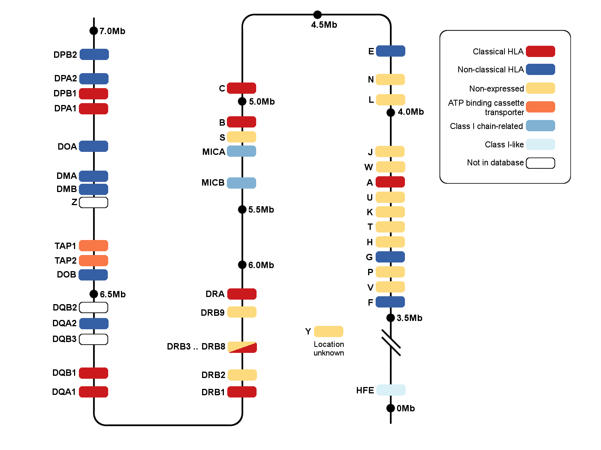
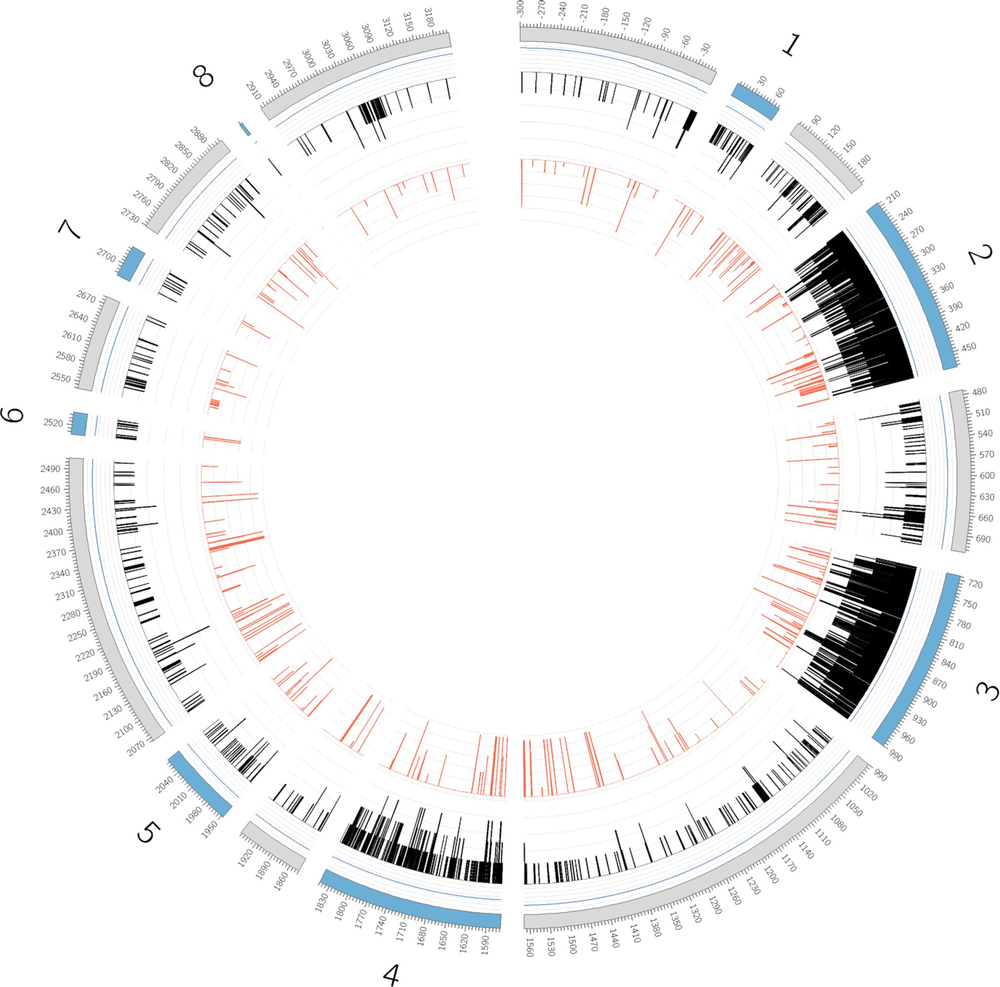

# HLA

The human lecukocyte antigen(HLA) system or complex is a group of related proteins that are encoded by the major histocompatibility complex (MHC) gene complex in humans. These cell-surface proteins are responsible for the regulation of the immune system. Mutations in HLA genes may be linked to autoimmune disease such as type I diabetes, and celiac disease. The HLA gene complex resides on a 3 Mbp strech within chromosome 6, p-arm at 21.3. HLA genes are highly polymorphic, which means that they have many different alleles, allowing them to fine-tume the adaptive immune system. The proteins encoded by certain genes are also known as qntigenes, as a result of their historic discovery as factors in organ transplants. Different classes have different functions.

HLAs corresponding to MHC class I (A, B and C), all of which are the HLA Class1 group, present peptides from inside the cell.

HLAs corresponding to MHC class II (DP, DM, DO, DQ, and DR) present antigens from outside of the cell to T-lymphocytes. 

HLAs corresponding to MHC class III encode components of the complement system.

HLAs have other roles. They are important in disease defense. They are the major cause of organ transplant rejections. They may protect against or fail to protect(id down-regulated by an infection) against cancers. HLA may also be releted to people's perception of the odor of other people, and may be involoved in mate selection, as at least one study found a lower-than-expected rate of HLA similiarity between spuses in an isolated community.

The IPD-IMGT/HLA Database provides a specialist database for sequences of the human major histocompatibility complex (MHC) and includes the official sequences named by the WHO Nomenclature Committee For Factors of the HLA System.

The following figure is from publication(IPD-IMGT/HLA Database, Nucleic Acids Rseqrch, 2020, Vol. 48). A graphical representation of the variation seen in the HLA-A sequences. Moving from the perimeter towards the centre of the diagram, the outer ring represents the different regions, with the exons filled in blue and numbered, the gDNA positions are also shown. The next layer represents the percentage of alleles with sequence in the database, the further towards the centre, the higher the percentage of alleles with sequence, note exons 2 and 3 where this sequence is mandatory for acceptance in the database. The penultimate inner ring represents the numbers of bases, (A, C, G, T or an indel) seen at each position with the baseline representing a monomorphic position. The final inner ring shows in red, the frequency of the second most common base at each position. The diagram can therefore be seen to show that whilst variation is highest in exons 2 and 3, it is not limited to these regions and there are clear regions of conserved variation throughout the gene.

